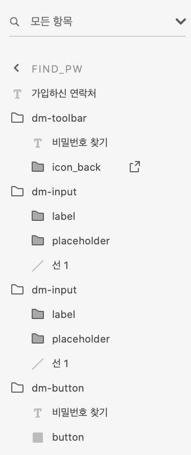
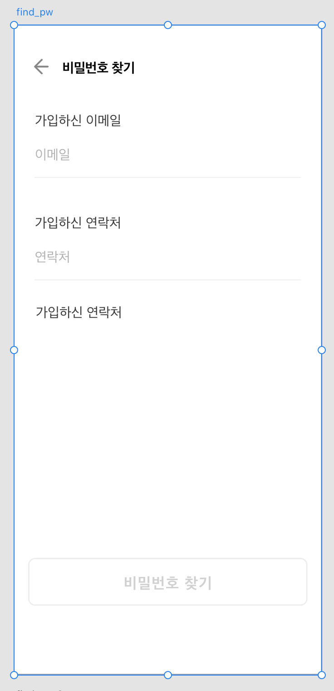
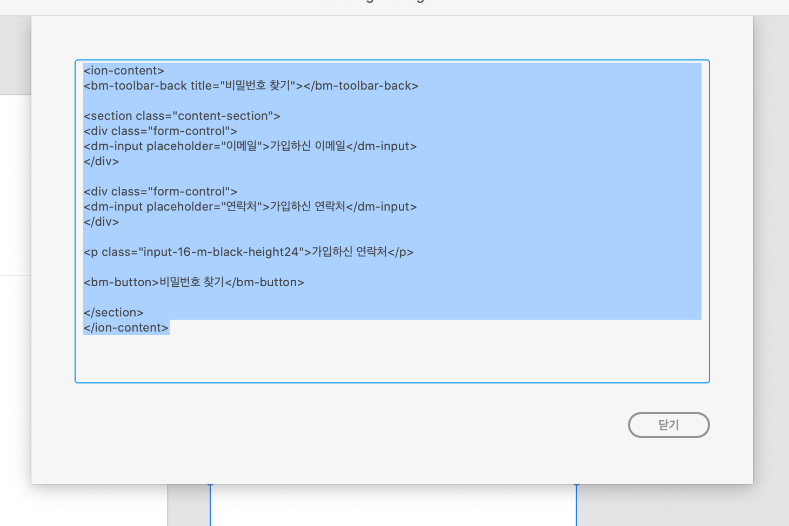

# XD-Angular-Plugin

## 설정 방법

1. yarn install
2. npm run dev 실행
3. npm run xdpm:watch 실행
4. XD -> 플러그인 -> dm -> Export Rendition

## 사용 방법

XD의 아트보드를 하나 선택하여 플러그인을 실행하면
Dialog에서 angular Html 로 변환 된 코드를
확인 할 수 있습니다.

아트보드에 Group의 이름에 따라 반환하게 됩니다.

현재 지원하는 Group, Text는 아래와 같습니다.
1. dm-toolbar
2. dm-input
3. dm-button
4. Text
입니다.









```angular2html
<ion-content>
<bm-toolbar-back title="비밀번호 찾기"></bm-toolbar-back>

<section class="content-section">
<div class="form-control">
<dm-input placeholder="이메일">가입하신 이메일</dm-input>
</div>

<div class="form-control">
<dm-input placeholder="연락처">가입하신 연락처</dm-input>
</div>

<p class="input-16-m-black-height24">가입하신 연락처</p>

<bm-button>비밀번호 찾기</bm-button>

</section>
</ion-content>
```